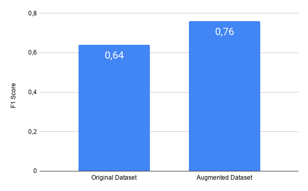
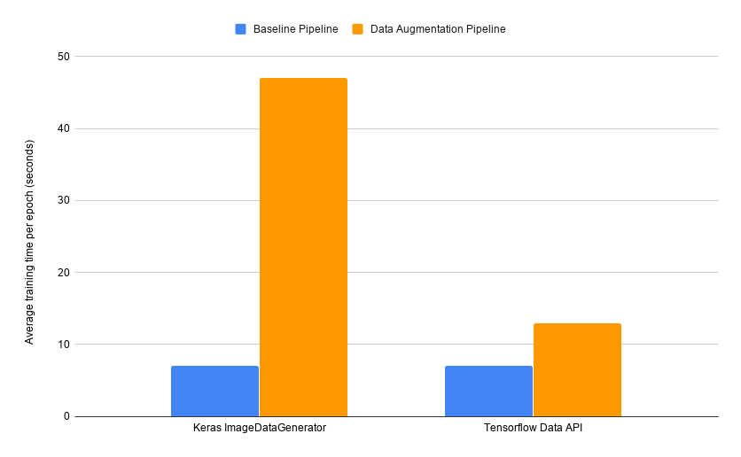
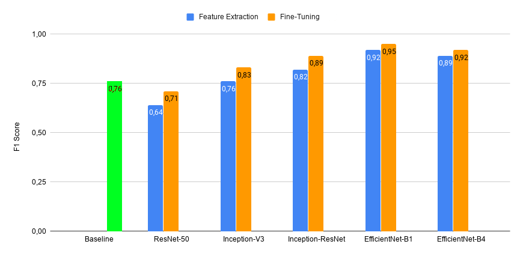
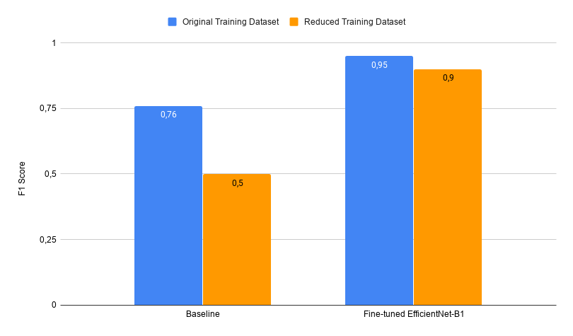

# Flowers Recognition

## Overview
This repository contains some notebooks for classifying the [Kaggle Flower Recognition](https://www.kaggle.com/alxmamaev/flowers-recognition) dataset, which consists of 4242 images of flowers belonging to 5 different categories. The aim of this repository is just to collect some of the notebooks I developed for practising with Image Classification and summarising the results I obtained trying out different State-of-the-Art Neural Networks and training techniques. 

The experiments included in the notebooks have been carried out with the following goals in mind:  
1. Assess which are the most effective State-of-the-Art Neural Networks 
2. Determine the effectiveness of Transfer Learning and compare it with a training from scratch approach
3. Analyse how the lack of training data affects, respectively, the Transfer Learning and training from scratch approaches.

## Adopted State-of-the-Art Neural Networks
The State-of-the-Art Nerual Networks adopted for carrying out the experiments are the following:
- Inception-V3
- ResNet-50
- Inception-ResNet
- EfficientNet-B1
- EfficientNet-B4

In Transfer Learning experiments, the ImageNet pre-trained weights have been used for each of the networks above. 

## Baseline
In order to define a baseline with which compare the results obtained with the State-of-the-Art networks, the flowers classification problem is initially addressed by training a simple convolutional network, both over the original available dataset and over the dataset obtained by applying Data Augmentation to the former one.

The baseline network is a CNN with 11 layers and 6,835,973 params.

The input pipelines developed for feeding data to the baseline network has been implemented either using the Tensorflow Data API and the Keras ImageDataGenerator class. The chart below shows the average training times per epoch obtained with each of these two pipeline implementations. 

## Transfer Learning
The ImageNet pre-trained State-of-the-Art neural networks have been used for performing feature extraction and fine-tuning. In both cases, the classifier connected to the output of each pre-trained convolutional base is a shallow classifier composed by a Global Average Pooling layer followed by a sofmax activation layer. 

The chart below summarises and compares the F1 scores obtained with each of the considered pre-trained networks. 

## Reduced Dataset Experiments
In order to asses the sensibility of the two considered approaches (e.g. Transfer Learning and Training from scratch) to the lack of training data, as well as to get an indicative measure of how much transfer learning can bring benefits when very little training data is available, the classification task have been addressed by training the networks on a reduced version of the training set. The number of examples and split percentages (referred to the com
plete unpartitioned Flowers dataset) of the old and new training, validation
and test sets are shown in the table below. 

||Training|Validation|Test
|--|--|--|--
|Original|3242 (75%)  |810 (15%)|271 (10%) 
|Reduced| 864 (20%)  | 1383 (32%) | 2076 (48%)

The pre-trained network that has been used for performing the experiments on the reduced training set is the one that in the previous tests lead to the best results in terms of precision and recall, that is EfficientNet-B1. The chart below shows a comparison between the F1 scores of the baseline model
and of the fine-tuned EfficientNet obtained on the original and new datasets.

