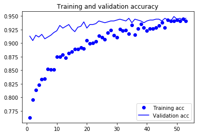
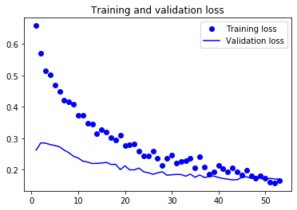

# Flowers Recognition

## Overview
This repository contains some notebooks for classifying the [Kaggle Flower Recognition](https://www.kaggle.com/alxmamaev/flowers-recognition) dataset, which consists of 4242 images of flowers belonging to 5 different categories. The aim of this repository is just to collect some of the notebooks I developed for practising with Image Classification and summarising the results I obtained trying out different techniques and tools. 

In each of the developed notebooks, the dataset is split into training, validation and test in the following percentages, respectively: 75%, 15% and 10%. All the images are also resized to 224x224 pixels. For evaluating the trained models, the adopted metrics are precision, recall and F1 score, all both micro and macro averaged. 

## Results summary

### Tensorflow Data API vs. Keras Image Processing
The [Tensorflow Data API](https://www.tensorflow.org/api_docs/python/tf/data) turns out to offer better performance than the Keras [Image Preprocessing](https://keras.io/preprocessing/image/) module. This is supposedly due to prefetching and caching operations offered by the former API, as explained [here](https://www.tensorflow.org/guide/data_performance). Moreover, the Tensorflow Data API turned out to be more flexible and easier to customise in term of data pre-processing and data augmentation operations. For these reasons, the Tensorflow Data API has been used for building the input pipeline of all the later developed notebooks. 

### Data Augmentation
Data augmentation provided a remarkable improvement of the models accuracy. After several tries, the best performance improvement has been achieved by performing random cropping, vertical/horizonal mirroring and brightness adjustment. With this set of data augmentation operations, the F1 macro score of the neural network used in [tf_flowers_complete_tensorflow_dataset.ipynb](https://github.com/Telemaco019/flower_recognition/blob/master/tf_flowers_complete_tensorflow_dataset.ipynb) raised from 0.75 to 0.86. 

### Best results
So far, the highest accuracy has been reached using a fine-tuned EfficientNetB7 in [tf_flowers_complete_efficientnetb7.ipynb](https://github.com/Telemaco019/flower_recognition/blob/master/tf_flowers_complete_efficientnetb7.ipynb). The results of this model are the following: 

|Average Type |Prec |Rec |F1
|--- |--- |--- |---
|Micro|0.90|0.90|0.90
|Macro|0.91|0.90|0.90

Total number of wrong predictions on the test dataset: **20 out of 209**.

## Notebooks details
### [tf_flowers_complete_tensorflow_dataset.ipynb](https://github.com/Telemaco019/flower_recognition/blob/master/tf_flowers_complete_tensorflow_dataset.ipynb)
This notebook address the classification problem using the [Tensorflow Data API](https://www.tensorflow.org/api_docs/python/tf/data). 

Two models are trained, both based on the same deep CNN architecture. The first one is a plain model trained without
any regularization, while the second one is trained using data augmentation and dropout. 

All the images have been standard normalized (e.g. each image has mean equal to 0 and std deviation equal to 1).

The data augmentation consists of random cropping and mirroring and it has been performed using the API exposed by the tensorflow.image module, which has also been used for performing the resizing and the standardization of all images.

The best model has been trained for 45 epochs with early stopping (patience=10) and scored the following results: 

|Average Type |Precision |Recall |F1
|--- |--- |--- |---
|Micro|0.87|0.87|0.87
|Macro|0.86|0.86|0.86

### [tf_flowers_complete_image_generator.ipynb](https://github.com/Telemaco019/flower_recognition/blob/master/tf_flowers_complete_image_generator.ipynb)
This notebook uses the [Image Preprocessing](https://keras.io/preprocessing/image/) module provided by Keras. 

As well as in ``tf_flowers_complete_tensorflow_dataset.ipynb``, even in this notebook two models have been trained using the same CNN architecture. The main difference from the former notebook is that in this case no image standardization has been performed and the data is fed to the model using the Keras ImageDataGenerator class, which has also been used for performing data augmentation. Moreover, the data augmentation in this case is performed using zooming, rotation, horizontal mirroring and brightness adjustment. 

The best model has been trained for 45 epochs with early stopping (patience=10) and scored the following results: 

|Average Type |Precision |Recall |F1
|--- |--- |--- |---
|Micro|0.78|0.78|0.78
|Macro|0.79|0.79|0.78

### [tf_flowers_complete_efficientnetb0.ipynb](https://github.com/Telemaco019/flower_recognition/blob/master/tf_flowers_complete_efficientnetb0.ipynb)
This notebook uses a Keras implementation of [EfficientNet](https://ai.googleblog.com/2019/05/efficientnet-improving-accuracy-and.html), which is available on [this](https://github.com/qubvel/efficientnet) repository. In particular, EfficientNetB0 is used, adopting the weights of the model pre-trained on the ImageNet dataset.

The data is pre-processed and fit to the model using the Tensorflow Dataset API, in the same way as in [tf_flowers_complete_tensorflow_dataset.ipynb](https://github.com/Telemaco019/flower_recognition/blob/master/tf_flowers_complete_tensorflow_dataset.ipynb). Data augmentation is as well used and it is performed in the same way as in the mentioned notebook. 

The notebook includes several attempts: 
* **Take 1**: EfficientB0 is used as feature extractor by removing its last Dense layer and replacing it with a shallow network composed of two Dense layer: one with 512 neurons and ReLU activation function and the other with 5 neurons and Softmax activation function. During training, all the weights of the convolutional based represented by the pre-trained version of EfficientNetB0 are frozen. The last layer of the convolutional base is a GlobalMaxPooling layer.
* **Take 2**: same as take 1, but this time the last layer of the convolutional base is a GlobalAveragePooling layer.
* **Take 3**: EfficientNetB0 is trained from scratch on the available dataset, leaving unfrozen all the weights of the model and just replacing its final Dense layer with a 5 neurons Dense layer, since for the adopted dataset the possible classes are just 5.
* **Take 4**: fine-tuning of EfficientNetB0. The fine-tuning is performed by using the model already trained during take 1, unfreezing the parameters of its last few layers (the whole block 7 of the network is unfrozen) and performing a new training of such a model with a lower learning rate, in order to avoid disrupting the values of the parameters of the ImageNet pre-trained model.

### [tf_flowers_complete_efficientnetb7.ipynb](https://github.com/Telemaco019/flower_recognition/blob/master/tf_flowers_complete_efficientnetb7.ipynb)
Same as [tf_flowers_complete_efficientnetb0.ipynb](https://github.com/Telemaco019/flower_recognition/blob/master/tf_flowers_complete_efficientnetb0.ipynb), but this time using the biggest available Keras implementation of EfficientNet, e.g. EfficientNetB7. Even in this case, the ImageNet pre-trained version of the network is used. 

Due to the remarkable size of the network, it was not possible to perform Take 3 (e.g. training EfficientNet from scratch) using EfficientNetB7 on Google Colab. 